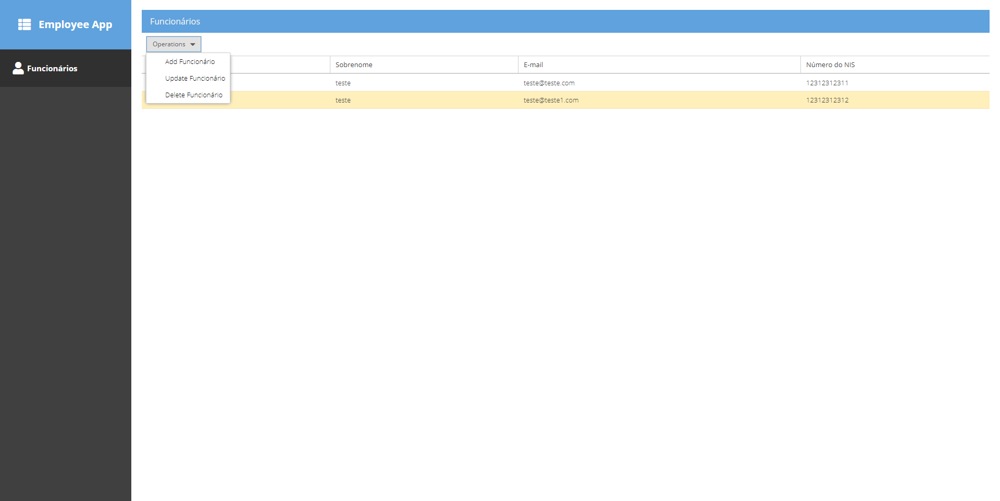
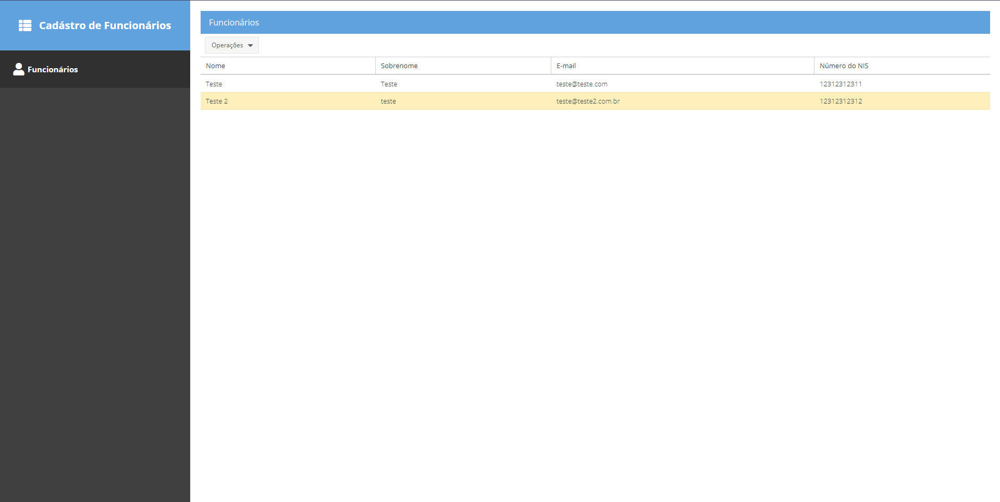
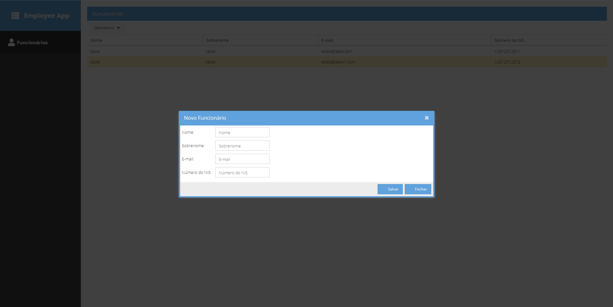
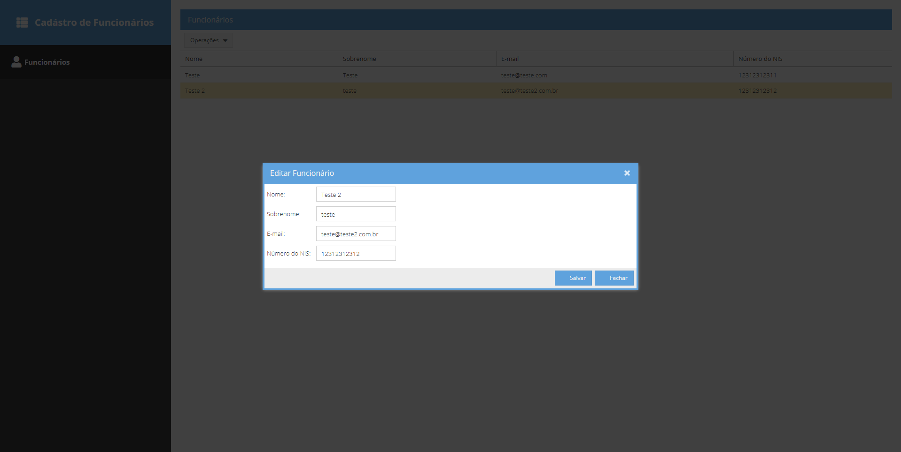
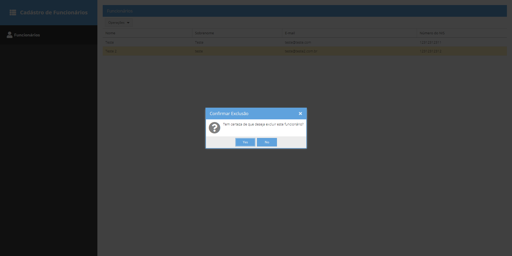

# Employee CRUD Application

## Descrição

Este é um projeto de CRUD (Create, Read, Update, Delete) de funcionários, construído com Spring Boot no backend e Sencha no frontend. O projeto permite a gestão de informações de funcionários, incluindo adição, edição, listagem e remoção de registros.

## Tecnologias Utilizadas

### Backend

- **Spring Boot**: Utilizado como framework principal para construção da aplicação.
- **Java 17**: Versão do Java utilizada.
- **JPA**: Para a interação com o banco de dados.
- **H2 Database**: Banco de dados em memória para desenvolvimento e testes.
- **Lombok**: Para simplificação do código através de anotações.

### Frontend

- **Sencha Ext JS 7**: Utilizado para o desenvolvimento da interface do usuário.

## Estrutura do Projeto

```
/Employee
    ├── src
    ├── pom.xml
    ├── Dockerfile
/Employee-front
    ├── app
    ├── resources
    ├── Dockerfile
docker-compose.yml
```

## Funcionalidades

Classes genéricas foram criadas para o reaproveitamento de código, oferecendo funcionalidades básicas como `getAll`, `getById`, `save`, `update` e `delete`. Além disso, foram seguidos os padrões de orientação a objetos, utilizando interfaces na parte de serviços, promovendo um design mais limpo e escalável.

## Configuração do Ambiente

### Pré-requisitos

- Docker e Docker Compose instalados.

### Rodando a Aplicação

1. Clone o repositório:

    ```bash
    git clone https://github.com/eimmig/crud-sencha-spring.git
    ```

2. Acesse a pasta clonada:
    ```bash
    cd crud-sencha-spring
    ```

3. Execute o comando abaixo para iniciar os serviços:

    ```bash
    docker-compose up --build
    ```

4. Aguarde a seguinte mensagem de log:
    ```bash
    frontend-1  | [INF] Loading Build Environment
    frontend-1  | [LOG] Fashion waiting for changes...
    frontend-1  | [INF] Waiting for changes...
    ```

5. A aplicação backend estará disponível em `http://localhost:8080`.
6. O frontend estará acessível em `http://localhost:1841`.

## Postman

Para testar a API, você pode usar o Postman. As rotas da API estão disponíveis em `http://localhost:8080`. Para facilitar, você pode importar uma coleção do Postman que contém as rotas. 

[](https://god.gw.postman.com/run-collection/24093493-13589c4e-2ee4-48c5-902a-70a36dbdf0cd?action=collection%2Ffork&source=rip_markdown&collection-url=entityId%3D24093493-13589c4e-2ee4-48c5-902a-70a36dbdf0cd%26entityType%3Dcollection%26workspaceId%3D1e651b6c-3f43-4deb-9908-054c2254a942)

## Testes

Os testes podem ser executados através do Maven. Navegue até o diretório do backend e execute:

```bash
mvn test
```

## Imagens do Projeto

1. 
2. 
3. 
4. 
5. 
